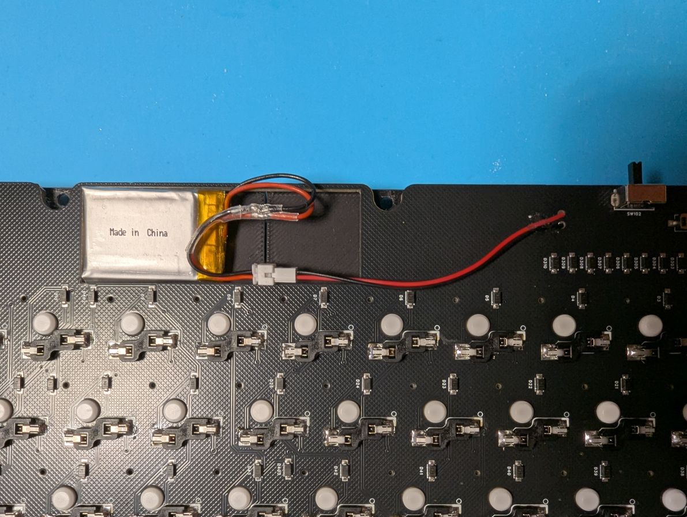

# ビルドガイド
## 部品確認
### 付属品
|名前|数|備考|
|:-|:-|:-|
|メインPCB|x1| |
|Seeed Studio XIAO nRF52840|x1|メインPCBに取付済み|
|バッテリー用ケーブル|x1|※無線化する場合のみ|
|スイッチプレート（左）|x1| |
|スイッチプレート（右）|x1| |
|ケース（左）|x1| |
|ケース（右）|x1| |
|M3x5mmネジ|x16| |
|M3x5mmスペーサー|x8| |
|M3x1.8mmスペーサー|x8|※一部キットのみ|
 
### 別途用意するもの
|名前|数|備考|
|:-|:-|:-|
|キースイッチ|x72| |
|キーソケット|x72| |
|キーキャップ（日本語配列 or 英語配列）| | |
|3.7V電池（Lipoバッテリー想定）|x1|※無線化する場合のみ|
|両面テープ|x1| |

## スイッチソケット（PCBマウントスタビライザー）の実装
ソケットは日本語配列と英語配列で使用するキーに注意しながらはんだ付けする。  
 
## バッテリーケーブルの実装
メイン基板を裏向きにして、バッテリーのパッドに＋－を間違えないようにしてケーブルを差し込む。  
※上が+（VCC、赤）、下が-（GND、黒）  

表からはんだ付けする。  
はんだ付け後、裏面に伸びたリード線はショートしないようにカットする。  
バッテリーケーブルはテープや接着剤でPCBに固定することを推奨。  

## バッテリーの実装
PCB上部中央の空間に収まるようにバッテリーを両面テープなどで固定する。  
※ケーブルのコネクタも空間に収まるように調整すること。 
バッテリーケーブルとバッテリーを接続する。（赤線と赤線、黒線と黒線がつながるようにすること。）  

## スイッチプレートの組み立て
スイッチプレートとメインPCBを重ねてスイッチを挿していく。  
 
## ケースの組み立て
M3ネジでPCBをケースに固定する。  

## ファームウェアの書き込み
USBケーブルでPCに接続する。  
裏面のリセットスイッチを素早く2回クリックするとUSBドライブとしてマウントされる。  
UF2ファイルをドラッグ＆ドロップするとファームウェアの書き込みが始まる。  
完了すると自動的に切断され、使用できる状態となる。  
 
## レイヤー機能
|#|レイヤー|機能|
|:-|:--|:--|
|0|USレイヤー|デフォルトのレイヤー|
|1|疑似JISレイヤー|tabキー長押しで有効/無効を切り替える。|
|2|Functionレイヤー|
|3|BTレイヤー|数字1~5を押すことで接続プロファイルを切り替える。|

### JISレイヤー機能
・tabキー長押しでレイヤー1（疑似JISレイヤー）を有効/無効を切り替える。  
・レイヤー1は日本語配列として認識しているキーボードで英語配列の入力ができる。  
（例：日本語配列として認識しているPCで、レイヤー1を有効にしてSHIFT+2→＠を入力） 

### 接続プロファイル切り替え機能
・「＼」キーを押している間レイヤー3が有効になり、同時に数字1~5を押すことで接続プロファイルを切り替える。  
・レイヤー5で「`」キー→現在の接続プロファイルを消去する。tabキー→接続プロファイルを全て消去する。  
 
## その他
### 電源スイッチ
電源スイッチは左側でON、右側でOFFとなる。  